```{r setup, include=FALSE}
knitr::opts_chunk$set(
  echo       = TRUE,
  message    = FALSE,
  warning    = FALSE,
  out.width  = "100%",
  fig.asp    = 0.518, 
  fig.show   = "hold",
  fig.pos    = "center",
  fig.align  = "center",
  dpi        = 600
)

options(
  digits = 3,
  knitr.table.format = "html"
)
```


---
## 论文
<br>
```{r, echo=FALSE}

```

.center[<https://doi.org/10.1093/jcr/ucab047>]


---
## 论文研究了5个主题

<br>

- STUDY 1
- STUDY 2
- STUDY 3
- STUDY 4
- STUDY 5A
- STUDY 5B AND 5C


---
## 我们先关注Study 1

<br>

- .red[**STUDY 1**]
- STUDY 2
- STUDY 3
- STUDY 4
- STUDY 5A
- STUDY 5B AND 5C

---
## Study 1

```{r}
library(tidyverse)

d <- haven::read_sav("./data/Study 1.sav")
```


```{r, echo=FALSE}
d %>% 
  head() %>% 
  flextable::flextable() %>% 
  flextable::autofit()
```


- **SelfManip ** : selfishness manipulation(1 = high, -1 = low)
- **ZEI**        : Standardized EI scores
- **CoinFlip2 ** : whether participants lied(1 =lied, 0 = not lie)


---
## 

.pull-left[

```{r, echo=FALSE}
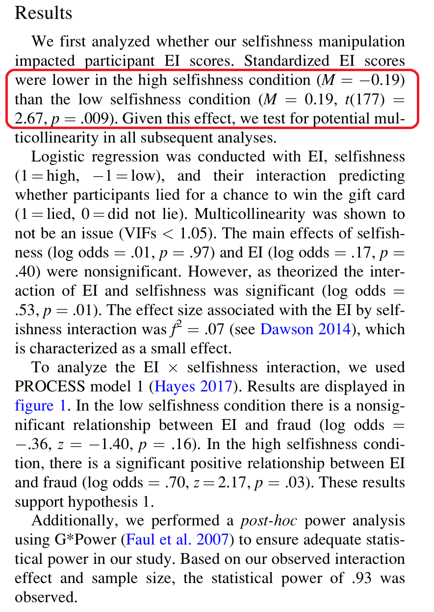
```

]

.pull-right[

```{r, eval=FALSE}
d %>% 
  group_by(SelfManip) %>% 
  summarise(
    M = mean(ZEI)
  )
```

```{r, echo=FALSE}
d %>% 
  group_by(SelfManip) %>% 
  summarise(
    M = mean(ZEI)
  ) %>% 
  flextable::flextable() %>% 
  flextable::autofit() %>% 
  flextable::color(j = "M", color = "red")
```


```{r, eval=FALSE}
d %>% 
  rstatix::t_test(ZEI ~ SelfManip)
```

```{r, echo=FALSE}
d %>% 
  rstatix::t_test(ZEI ~ SelfManip) %>%  
  flextable::flextable() %>% 
  flextable::autofit() %>% 
  flextable::color(j = c("statistic", "df", "p"), color = "red")
```

]


---
## 

.pull-left[

```{r, echo=FALSE}
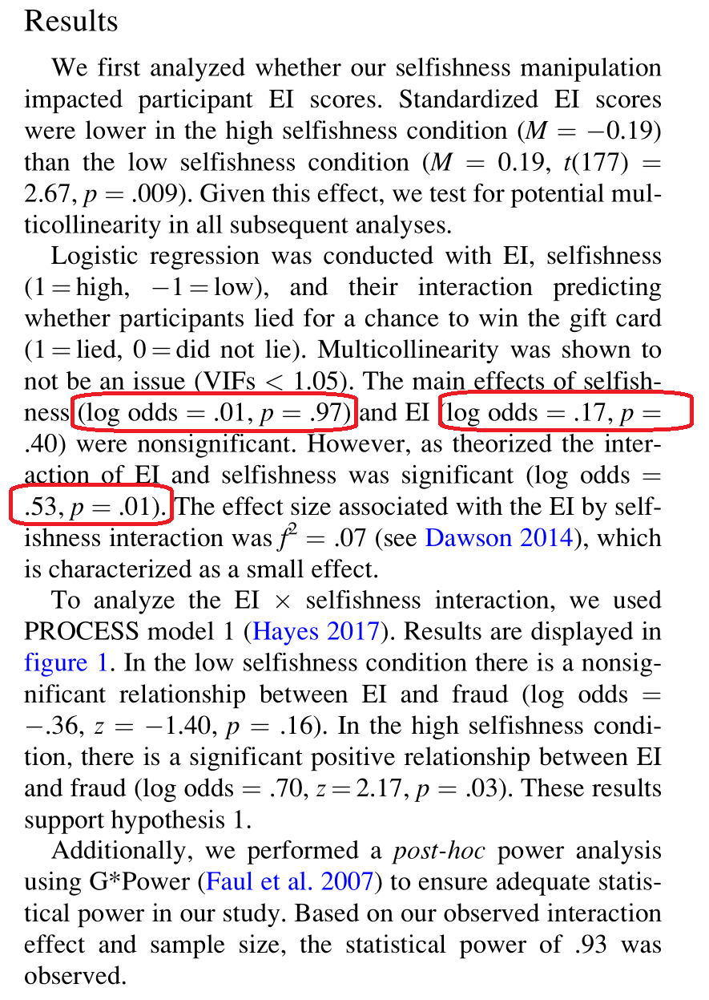
```

]

.pull-right[

```{r}
mod <- glm(
  CoinFlip2 ~ SelfManip * ZEI,
  data   = d,
  family = binomial(link = "logit")
)

mod %>%
  gtsummary::tbl_regression() #<<
```


]


---
## 

.pull-left[

```{r, echo=FALSE}
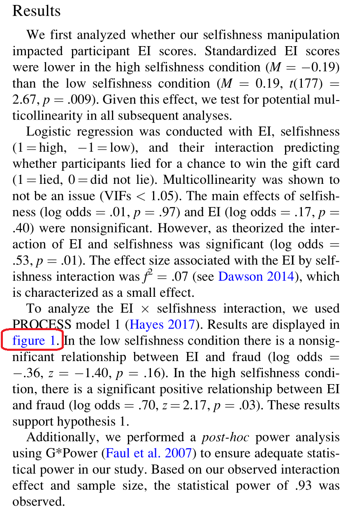
```

]


.pull-right[

```{r, eval=FALSE}
library(marginaleffects)

mod %>% 
  marginaleffects::predictions(     #<<
    newdata = datagrid(SelfManip = c(-1, 1), 
                       ZEI       = c(-1, 1)),
    type    = "response"
  ) %>% 
  as_tibble()
```


```{r, echo=FALSE}
library(marginaleffects)

mod %>% 
  marginaleffects::predictions(
    newdata = datagrid(SelfManip = c(-1, 1), ZEI = c(-1, 1)),
    type    = "response"
  ) %>% 
  as_tibble() %>%  
  select(-std.error, -p.value, -s.value, -CoinFlip2) %>% 
  flextable::flextable() %>% 
  flextable::autofit() %>% 
  flextable::color(j = c("estimate", "SelfManip", "ZEI"), color = "red")
```
]


---
## 

.pull-left[

```{r, echo=FALSE}
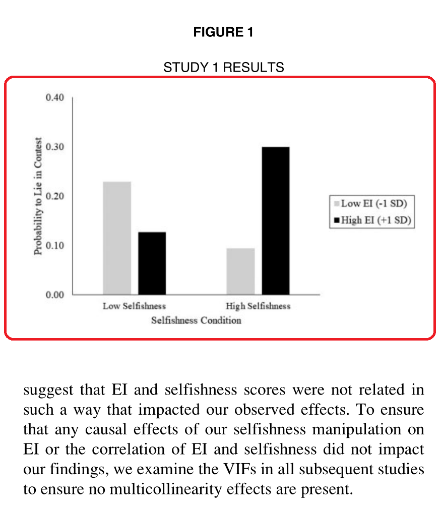
```

]


.pull-right[

```{r, eval=FALSE}
mod %>% 
  marginaleffects::predictions(
    newdata = datagrid(SelfManip = c(-1, 1), 
                       ZEI       = c(-1, 1))
  ) %>% 
  as_tibble() %>% 
  mutate(
    across(c(SelfManip, ZEI), as.factor)
  ) %>% 
  ggplot(aes(x = SelfManip, y = estimate)) +       #<<
  geom_col(aes(fill = ZEI),                        #<<
    position = position_dodge(width = 0.8)         #<<
  )                                                #<<
```

```{r, echo=FALSE, fig.asp=0.9, fig.width = 5, out.width= "60%"}
library(marginaleffects)
mod %>% 
  marginaleffects::predictions(
    newdata = datagrid(SelfManip = c(-1, 1), ZEI = c(-1, 1)),
    type    = "response"
  ) %>% 
  as_tibble() %>% 
  mutate(across(c(SelfManip, ZEI), as.factor)) %>% 
  
  ggplot(aes(x = SelfManip, y = estimate)) +
  geom_col(
    aes(fill = ZEI), 
    position = position_dodge(width = 0.8),
    width = 0.7
  ) +
  scale_x_discrete(
    name =  "Selfishness Condition",
    breaks = c(-1, 1),
    labels = c("Low selfishness", "High selfishness")
  ) +
  scale_y_continuous(
    name =  "Probability to Lie in contest",
    limits = c(0, 0.4),
    expand = c(0, 0)
  ) +
  scale_fill_manual(
    values = c("gray85", "black")
  ) +
  theme_classic()
```


]


---
## 

.pull-left[

```{r, echo=FALSE}
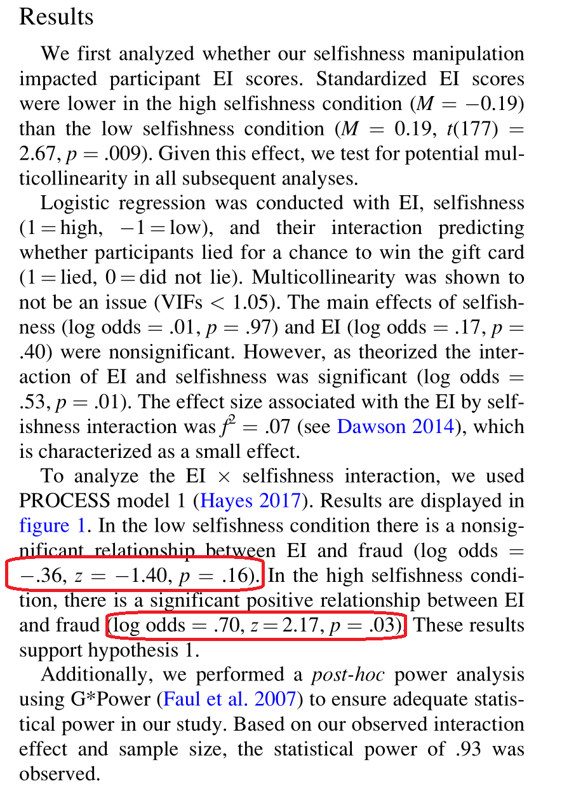
```

]

.pull-right[

```{r, eval=FALSE}
mod %>% 
  marginaleffects::slopes(  #<<
    variables = "ZEI",
    by        = "SelfManip",
    type      = "link"
  ) %>% 
  as_tibble()
```


```{r, echo=FALSE}
mod %>% 
  marginaleffects::slopes(
    variables = "ZEI",
    by        = "SelfManip",
    type      = "link"
  ) %>% 
  as_tibble() %>%  
  select(1:7) %>% 
  flextable::flextable() %>% 
  flextable::autofit() %>% 
  flextable::color(j = c("estimate", "statistic", "p.value"), color = "red")
```


]


---
## 我们接着看Study 2

<br>

- STUDY 1
- .red[**STUDY 2**]
- STUDY 3
- STUDY 4
- STUDY 5A
- STUDY 5B AND 5C


---
## Study 2

```{r}
library(tidyverse)

d <- haven::read_sav("./data/Study 2.sav")
```


```{r, echo=FALSE}
d %>% 
  head() %>% 
  flextable::flextable() %>% 
  flextable::autofit()
```


- **ZSelfish** : selfishness manipulation(1 =high, 1 = low)
-  **ZEI**     : Standardized EI scores
- **Fraud**    : whether participants stole(1 = yes, 0 = no)


---
## 

.pull-left[

```{r, echo=FALSE}
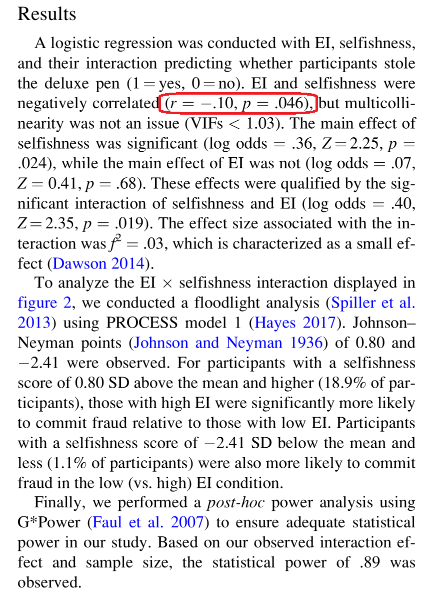
```

]


.pull-right[

```{r}
cor(d$ZEI, d$ZSelfish)
```


<br>
```{r, eval = FALSE}
d %>% 
  rstatix::cor_test(vars = c(ZEI, ZSelfish))
```


```{r, echo=FALSE}
d %>% 
  rstatix::cor_test(vars = c(ZEI, ZSelfish)) %>% 
  flextable::flextable() %>% 
  flextable::autofit() %>% 
  flextable::color(j = "p", color = "red")
```
]


---
## 

.pull-left[

```{r, echo=FALSE}
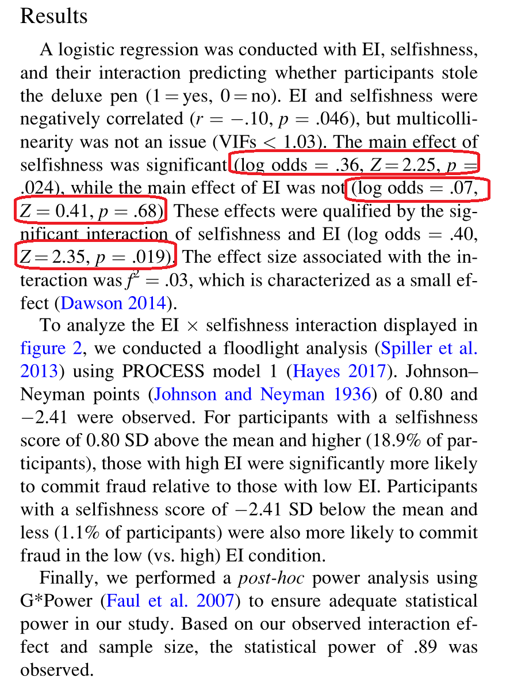
```

]


.pull-right[

```{r}
mod <- glm(
  Fraud ~ ZSelfish * ZEI,
  data = d,
  family = binomial(link = "logit")
)

mod %>%
  gtsummary::tbl_regression()     #<<
```
]


---
## 


.pull-left[

```{r, echo=FALSE, out.width="100%"}
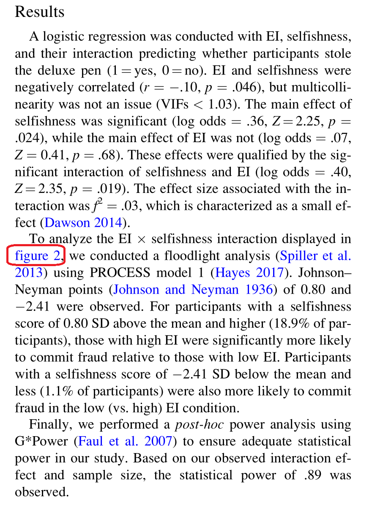
```

]


.pull-right[

```{r, eval=FALSE}
library(marginaleffects)

mod %>% 
  marginaleffects::predictions(    #<<
    newdata = datagrid(
      ZSelfish = seq(-2, 2, by = 0.1), 
      ZEI      = c(-1, 1)
    ),
    type    = "response"
  ) %>% 
  as_tibble()
```


```{r, echo=FALSE}
library(marginaleffects)
mod %>% 
  marginaleffects::predictions(
    newdata = datagrid(
      ZSelfish = seq(-2, 2, by = 0.1), 
      ZEI      = c(-1, 1)
    ),
    type    = "response"
  ) %>% 
  as_tibble() %>% 
  head(8) %>% 
  select(-std.error, -p.value, -s.value, -Fraud) %>% 
  flextable::flextable() %>% 
  flextable::autofit() %>% 
  flextable::color(j = c("estimate", "ZSelfish", "ZEI"), color = "red")
```
]


---
## 


.pull-left[

```{r, echo=FALSE}
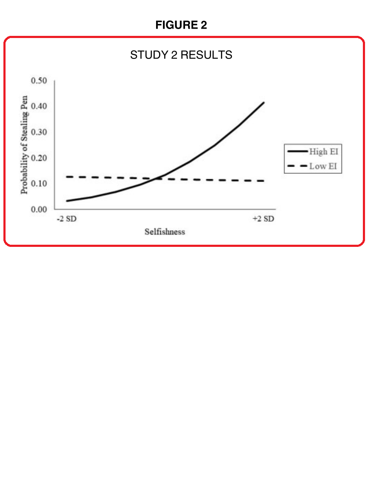
```

]


.pull-right[

```{r, eval=FALSE}
mod %>%
  marginaleffects::predictions(
    newdata = datagrid(
      ZSelfish = seq(-2, 2, by = 0.1),
      ZEI      = c(-1, 1)),
    type = "response"
  ) %>%
  as_tibble() %>%
  mutate(across(ZEI, as.factor)) %>%
  ggplot(aes(x = ZSelfish, y = estimate,   #<<
      group = ZEI) ) +                     #<<
  geom_line(aes(linetype = ZEI),           #<<
      linewidth = 1)                       #<<
```


```{r, echo=FALSE, fig.asp=0.618, fig.width = 5, out.width= "80%"}
mod %>% 
  marginaleffects::predictions(
    newdata = datagrid(
      ZSelfish = seq(-2, 2, by = 0.1), 
      ZEI      = c(-1, 1)
    ),
    type    = "response"
  ) %>% 
  as_tibble() %>% 
  
  mutate(across(ZEI, as.factor)) %>% 
  ggplot(aes(x = ZSelfish, y = estimate,group = ZEI)) +
  geom_line(aes(linetype = ZEI), linewidth = 1)  +
  scale_linetype_manual(
    name = NULL,
    values = c("dotted", "solid"),
    labels = c("Low EI", "High EI"),
    guide = guide_legend(reverse = TRUE)
  ) +
  scale_x_continuous(
    name   = "Selfishness",
    breaks = c(-2, 2),
    labels = c("-2SD", "+2 SD")
  ) +
  scale_y_continuous(
    name   = "Probability of stealing pen",
    limits = c(0, 0.5),
    expand = c(0, 0)
  ) +
  theme_classic(base_size = 16) +
  theme(axis.ticks.x = element_blank())
```

]


---
## 我们接着看Study 3

<br>

- STUDY 1
- STUDY 2
- .red[**STUDY 3**]
- STUDY 4
- STUDY 5A
- STUDY 5B AND 5C


---
## Study 3

```{r}
library(tidyverse)

d <- haven::read_sav("./data/Study 3.sav")
```


```{r, echo=FALSE}
d %>% 
  head() %>% 
  flextable::flextable() %>% 
  flextable::autofit()
```

- **Cond**     : Selfishness (1 =high, -1 = low)
- **PriceTag** : Willingness to switch price Tag
- **GSR**      : Physiological Arousal
- **CEISStd**  : emotional intelligence
- **SelfCks**  : selfishness manipulation check


---
## 

.pull-left[

```{r, echo=FALSE}
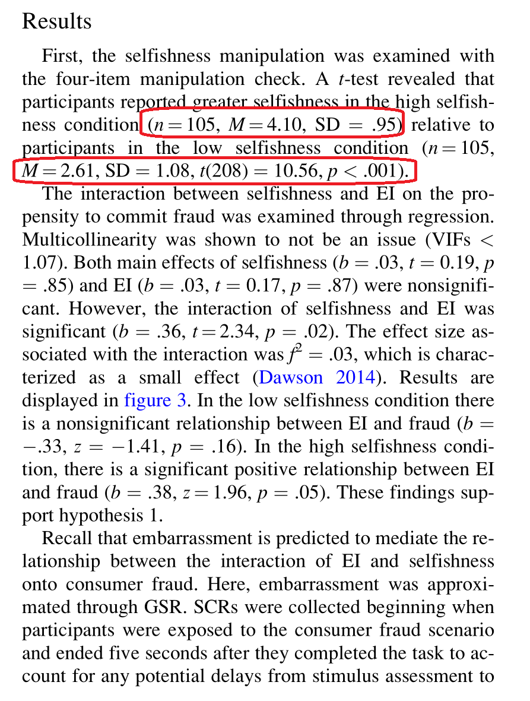
```

]


.pull-right[

```{r, eval = FALSE}
d %>% 
  group_by(Cond) %>% 
  summarise(
    n  = n(),
    M  = mean(SelfCks),
    SD = sd(SelfCks)
  )
```


```{r, echo=FALSE}
d %>% 
  group_by(Cond) %>% 
  summarise(
    n  = n(),
    M  = mean(SelfCks),
    SD = sd(SelfCks)
  ) %>% 
  flextable::flextable() %>% 
  flextable::color(j = c("M", "SD"), color = "red") %>% 
  flextable::autofit()
```


<br>

```{r, eval = FALSE}
d %>% 
  rstatix::t_test(SelfCks ~ Cond)
```

```{r, echo=FALSE}
d %>% 
  rstatix::t_test(SelfCks ~ Cond) %>% 
  flextable::flextable() %>% 
  flextable::colformat_double(digits = 3) %>% 
  flextable::color(j = c("statistic", "p"), color = "red") %>% 
  flextable::autofit()
```


]


---
## 

.pull-left[

```{r, echo=FALSE}
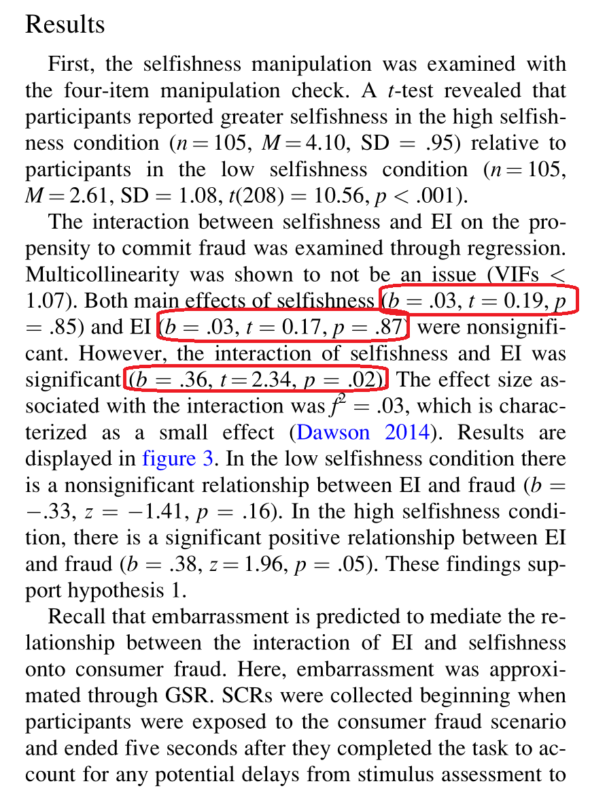
```

]


.pull-right[

```{r}
mod <- lm(
  PriceTag ~ Cond + CEISStd + Cond:CEISStd,
  data = d
)

mod %>%
  gtsummary::tbl_regression()  #<<
```

]


---
## 

.pull-left[

```{r, echo=FALSE}
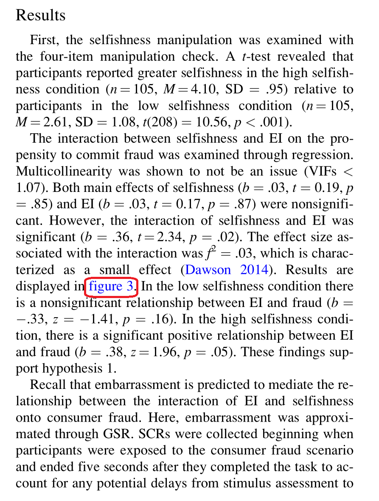
```

]


.pull-right[

```{r, eval=FALSE}
library(marginaleffects)

mod %>% 
  marginaleffects::predictions(   #<<
    newdata = datagrid(Cond    = c(-1, 1), 
                       CEISStd = c(-1, 1))
  ) %>% 
  as_tibble()
```


```{r, echo=FALSE}
library(marginaleffects)

mod %>% 
  marginaleffects::predictions(  
    newdata = datagrid(Cond    = c(-1, 1), 
                       CEISStd = c(-1, 1))
  ) %>% 
  as_tibble() %>% 
  head(8) %>% 
  select(-std.error, -p.value, -s.value, -PriceTag) %>% 
  flextable::flextable() %>% 
  flextable::autofit() %>% 
  flextable::color(j = c("estimate", "Cond", "CEISStd"), color = "red")
```
]


---
## 

.pull-left[

```{r, echo=FALSE}
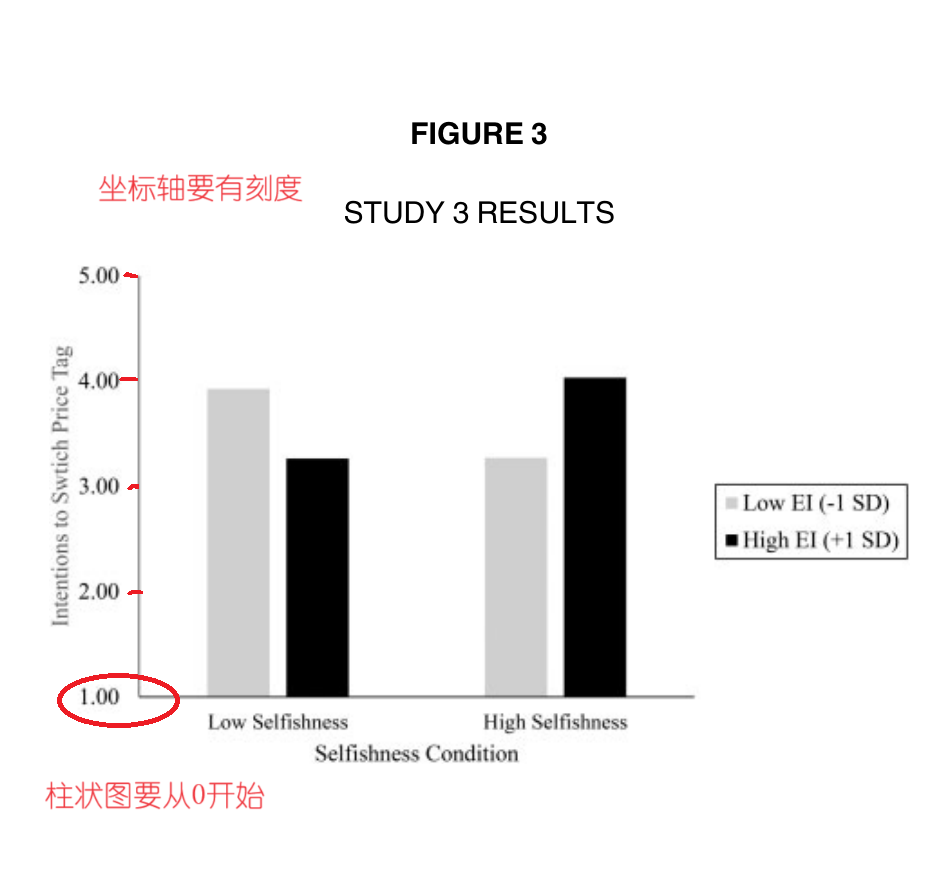
```

]


.pull-right[

```{r, eval=FALSE}
mod %>% 
  marginaleffects::predictions(
    newdata = datagrid(Cond    = c(-1, 1), 
                       CEISStd = c(-1, 1))
  ) %>% 
  as_tibble() %>% 
  mutate(
    across(c(Cond, CEISStd), as.factor)
  ) %>% 
  ggplot(aes(x = CEISStd, y = estimate)) +    #<<
  geom_col(                                   #<<
    aes(fill = Cond),                         #<<
    position = position_dodge(width = 0.6),   #<<
    width = 0.5                               #<<
  )                                           #<<
```


```{r, echo=FALSE, fig.asp=0.618, fig.width = 5, out.width= "80%"}
mod %>% 
  marginaleffects::predictions(
    newdata = datagrid(Cond    = c(-1, 1), 
                       CEISStd = c(-1, 1))
  ) %>% 
  as_tibble() %>% 
  
  mutate(across(c(Cond, CEISStd), as.factor)) %>% 
  ggplot(aes(x = CEISStd, y = estimate)) +
  geom_col(
    aes(fill = Cond), 
    position = position_dodge(width = 0.6),
    width = 0.5
  ) +
  scale_x_discrete(
    name =  "Selfishness Condition",
    breaks = c(-1, 1),
    labels = c("Low selfishness", "High selfishness")
  ) +
  scale_y_continuous(
    name =  "Intentions to Switch Price Tag",
    limits = c(0, 5),
    expand = c(0, 0)
  ) +
  scale_fill_manual(
    name   = NULL,
    values = c("gray85", "black"),
    labels = c("Low EI(-1 SD)", "High EI(+1 SD)")
  ) +
  theme_classic() +
  theme(axis.ticks.x = element_blank())
```


]


---
## 

.pull-left[

```{r, echo=FALSE}
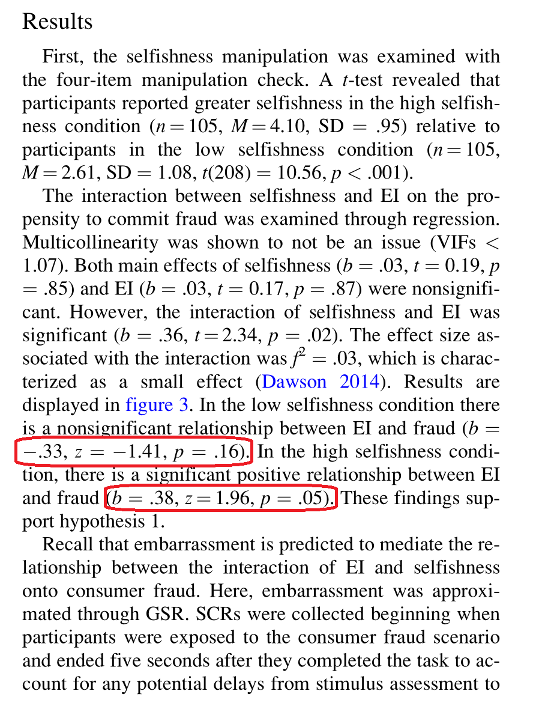
```

]


.pull-right[
```{r, eval=FALSE}
mod %>% 
  marginaleffects::slopes(   #<<
    variables = "CEISStd",
    by        = "Cond"
  ) %>% 
  as_tibble()
```


```{r, echo=FALSE}
mod %>% 
  marginaleffects::slopes(
    variables = "CEISStd",
    by        = "Cond"
  ) %>% 
  as_tibble() %>% 
  select(1:7) %>% 
  flextable::flextable() %>% 
  flextable::autofit() %>% 
  flextable::color(j = c("estimate", "statistic", "p.value"), color = "red")
```


]


---
## 

.pull-left[

```{r, echo=FALSE, out.width= "85%"}
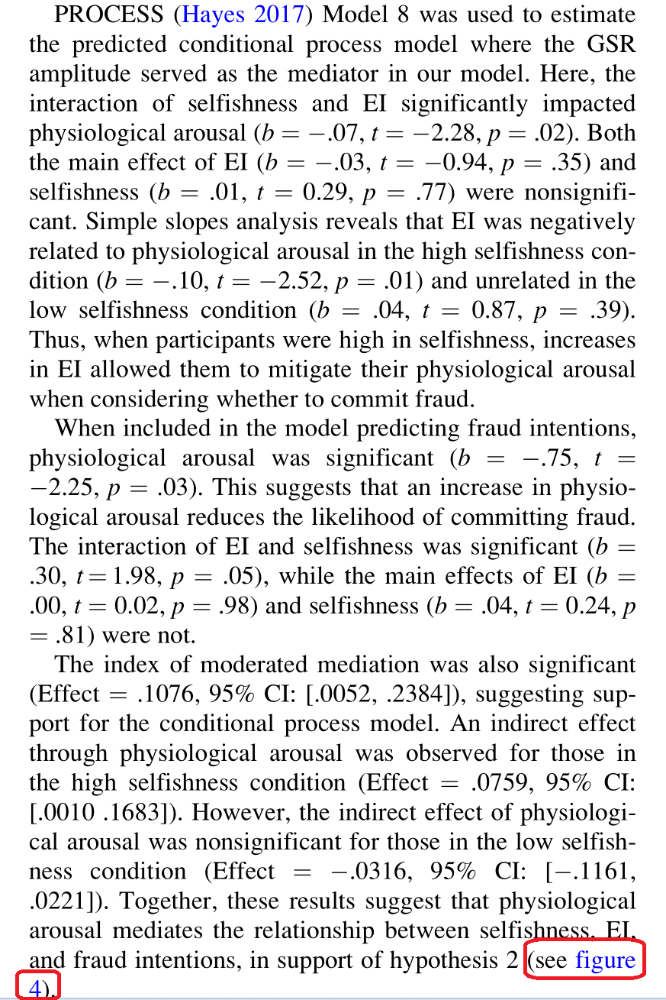
```

]


.pull-right[

```{r, echo=FALSE}
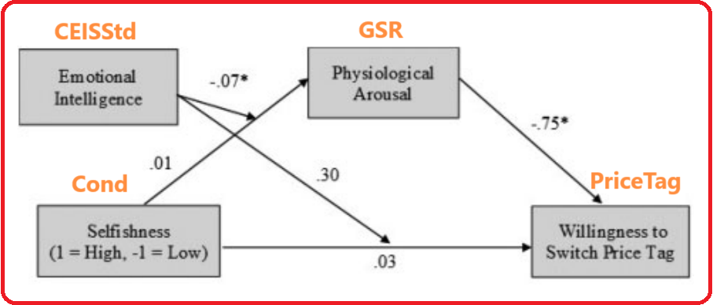
```
.small[
```{r}
library(lavaan)

model <- '
  GSR      ~ a1*Cond + a2*CEISStd + a3*Cond:CEISStd 
  PriceTag ~ c1*Cond + c2*CEISStd + c3*Cond:CEISStd + b*GSR

  # Index of Moderated Mediation
  IndexOfModMed := a3 * b

  # Simple Slopes
  aSSLow  := a2 + a3 * (-1)    
  aSSHigh := a2 + a3 * (1)     
   
  # Conditional Indirect Effects
  abLow  := aSSLow * b
  abHigh := aSSHigh * b

'

fit <- sem(model, 
           data      = d, 
           estimator = "ML", 
           se        = "bootstrap",
           bootstrap = 1000,
           mimic     = "Mplus")
```

]
]


---
## 

.pull-left[

```{r, echo=FALSE, out.width= "85%"}
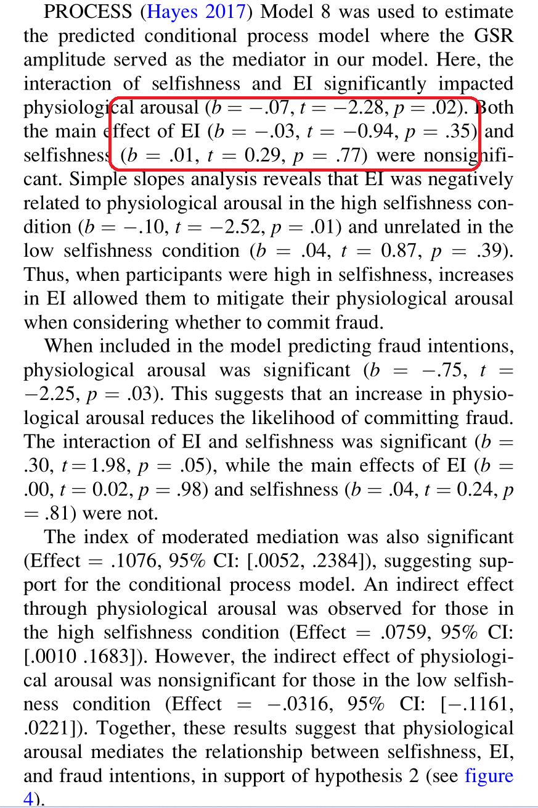
```

]


.pull-right[

.small[
```{r, eval=FALSE}
model <- '
  GSR      ~ a1*Cond + a2*CEISStd + a3*Cond:CEISStd          #<<
  PriceTag ~ c1*Cond + c2*CEISStd + c3*Cond:CEISStd + b*GSR  #<<

  # Index of Moderated Mediation
  IndexOfModMed := a3 * b

  # Simple Slopes
  aSSLow  := a2 + a3 * (-1)    
  aSSHigh := a2 + a3 * (1)     
   
  # Conditional Indirect Effects
  abLow  := aSSLow  * b
  abHigh := aSSHigh * b

'
```
]

```{r, echo=FALSE}
fit %>% 
  parameterEstimates(ci = TRUE) %>% 
  filter(op %in% c("~", ":=")) %>%  
  select(-lhs, -op, -rhs) %>% 
  flextable::flextable() %>% 
  flextable::colformat_double(digits = 3) %>% 
  flextable::fontsize(size = 10, part = "all") %>% 
  flextable::line_spacing(space = 0.8, part = "body") %>% 
  flextable::color(
    i = ~ label %in% c("a1", "a2", "a3"), 
    color = "red"
  )
```

]


---
## 

.pull-left[

```{r, echo=FALSE, out.width= "85%"}
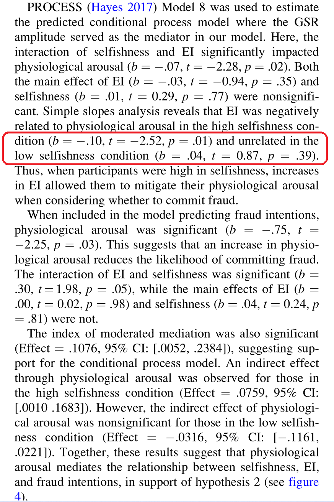
```

]


.pull-right[

.small[
```{r, eval=FALSE}
model <- '
  GSR      ~ a1*Cond + a2*CEISStd + a3*Cond:CEISStd          
  PriceTag ~ c1*Cond + c2*CEISStd + c3*Cond:CEISStd + b*GSR  

  # Index of Moderated Mediation
  IndexOfModMed := a3 * b

  # Simple Slopes
  aSSLow  := a2 + a3 * (-1)    #<<
  aSSHigh := a2 + a3 * (1)     #<<
   
  # Conditional Indirect Effects
  abLow  := aSSLow  * b
  abHigh := aSSHigh * b

'
```
]

```{r, echo=FALSE}
fit %>% 
  parameterEstimates(ci = TRUE) %>% 
  filter(op %in% c("~", ":=")) %>%  
  select(-lhs, -op, -rhs) %>% 
  flextable::flextable() %>% 
  flextable::colformat_double(digits = 3) %>% 
  flextable::fontsize(size = 10, part = "all") %>% 
  flextable::line_spacing(space = 0.8, part = "body") %>% 
  flextable::color(
    i = ~ label %in% c("aSSLow", "aSSHigh"), 
    color = "red"
  )
```

]


---
## 

.pull-left[

```{r, echo=FALSE, out.width= "85%"}
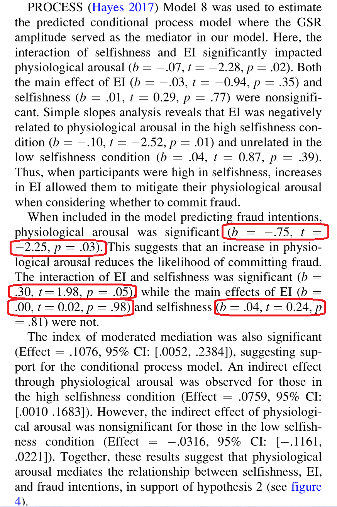
```

]


.pull-right[
.small[
```{r, eval=FALSE}
model <- '
  GSR      ~ a1*Cond + a2*CEISStd + a3*Cond:CEISStd          #<<
  PriceTag ~ c1*Cond + c2*CEISStd + c3*Cond:CEISStd + b*GSR  #<<

  # Index of Moderated Mediation
  IndexOfModMed := a3 * b

  # Simple Slopes
  aSSLow  := a2 + a3 * (-1)    
  aSSHigh := a2 + a3 * (1)     
   
  # Conditional Indirect Effects
  abLow  := aSSLow  * b
  abHigh := aSSHigh * b

'
```
]

```{r, echo=FALSE}
fit %>% 
  parameterEstimates(ci = TRUE) %>% 
  filter(op %in% c("~", ":=")) %>%  
  select(-lhs, -op, -rhs) %>% 
  flextable::flextable() %>% 
  flextable::colformat_double(digits = 3) %>% 
  flextable::fontsize(size = 10, part = "all") %>% 
  flextable::line_spacing(space = 0.8, part = "body") %>% 
  flextable::color(
    i = ~ label %in% c("b", "c1", "c2", "c3"), 
    color = "red"
  )
```

]


---
## 

.pull-left[

```{r, echo=FALSE, out.width= "85%"}
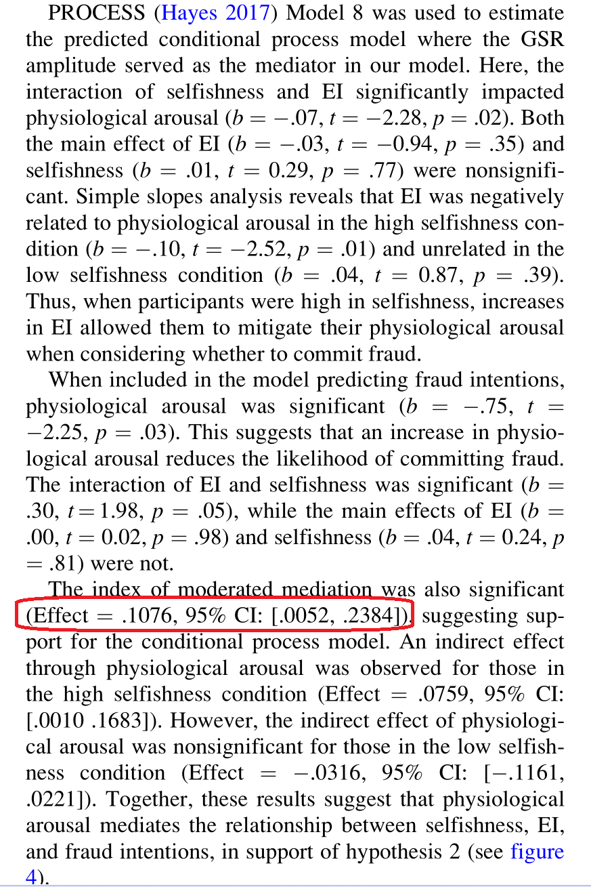
```

]


.pull-right[

.small[
```{r, eval=FALSE}
model <- '
  GSR      ~ a1*Cond + a2*CEISStd + a3*Cond:CEISStd          
  PriceTag ~ c1*Cond + c2*CEISStd + c3*Cond:CEISStd + b*GSR  

  # Index of Moderated Mediation
  IndexOfModMed := a3 * b     #<<

  # Simple Slopes
  aSSLow  := a2 + a3 * (-1)    
  aSSHigh := a2 + a3 * (1)     
   
  # Conditional Indirect Effects
  abLow  := aSSLow  * b
  abHigh := aSSHigh * b

'
```
]

```{r, echo=FALSE}
fit %>% 
  parameterEstimates(ci = TRUE) %>% 
  filter(op %in% c("~", ":=")) %>%  
  select(-lhs, -op, -rhs) %>% 
  flextable::flextable() %>% 
  flextable::colformat_double(digits = 3) %>% 
  flextable::fontsize(size = 10, part = "all") %>% 
  flextable::line_spacing(space = 0.8, part = "body") %>%  
  flextable::color(
    i = ~ label %in% c("IndexOfModMed"), 
    color = "red"
  )
```


这里有点差异！可能是我没理解正确
]


---
## 

.pull-left[

```{r, echo=FALSE, out.width= "85%"}
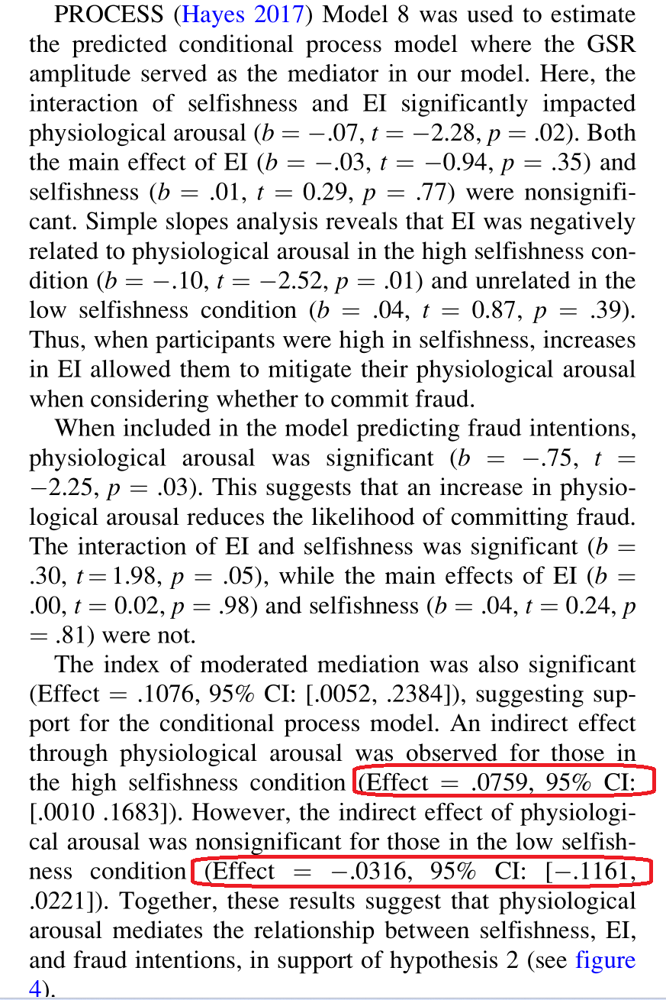
```

]


.pull-right[
.small[
```{r, eval=FALSE}
model <- '
  GSR      ~ a1*Cond + a2*CEISStd + a3*Cond:CEISStd          
  PriceTag ~ c1*Cond + c2*CEISStd + c3*Cond:CEISStd + b*GSR  

  # Index of Moderated Mediation
  IndexOfModMed := a3*b

  # Simple Slopes
  aSSLow  := a2 + a3 * (-1)    
  aSSHigh := a2 + a3 * (1)     
   
  # Conditional Indirect Effects
  abLow  := aSSLow  * b    #<<
  abHigh := aSSHigh * b   #<<

'
```
]

```{r, echo=FALSE}
fit %>% 
  parameterEstimates(ci = TRUE) %>% 
  filter(op %in% c("~", ":=")) %>%  
  select(-lhs, -op, -rhs) %>% 
  flextable::flextable() %>% 
  flextable::colformat_double(digits = 3) %>% 
  flextable::fontsize(size = 10, part = "all") %>% 
  flextable::line_spacing(space = 0.8, part = "body") %>% 
  flextable::color(
    i = ~ label %in% c("abLow", "abHigh"), 
    color = "red"
  ) 
```


]


---
## 我们接着看Study 4

<br>

- STUDY 1
- STUDY 2
- STUDY 3
- .red[**STUDY 4**]
- STUDY 5A
- STUDY 5B AND 5C


---
## Study 4

```{r}
library(tidyverse)

d <- haven::read_sav("./data/Study 4.sav")
```


```{r, echo=FALSE}
d %>% 
  head(8) %>% 
  flextable::flextable() %>% 
  flextable::color(
    j = c("Selfish", "Accident", "Embarrass", "SelfCheck", "ZEI"), 
    color = "red",
    part = "all"
  ) %>% 
  flextable::autofit()
```


---
## 

.pull-left[

```{r, echo=FALSE}
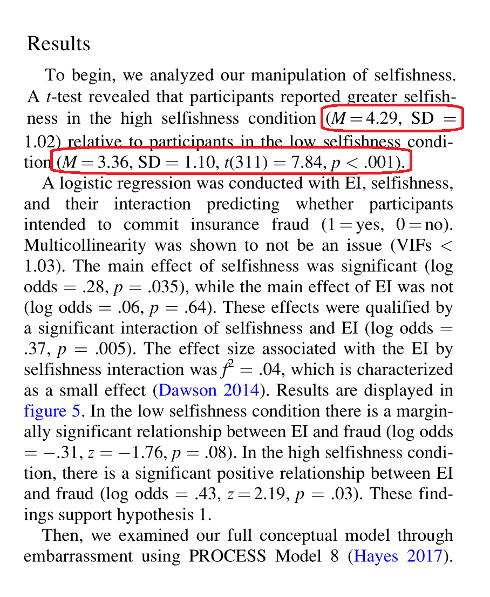
```

]


.pull-right[

```{r, eval = FALSE}
d %>% 
  group_by(Selfish) %>% 
  summarise(
    n  = n(),
    M  = mean(SelfCheck),
    SD = sd(SelfCheck)
  )
```


```{r, echo=FALSE}
d %>% 
  group_by(Selfish) %>% 
  summarise(
    n  = n(),
    M  = mean(SelfCheck),
    SD = sd(SelfCheck)
  ) %>% 
  flextable::flextable() %>% 
  flextable::color(j = c("M", "SD"), color = "red") %>% 
  flextable::autofit()
```


<br>

```{r, eval = FALSE}
d %>% 
  rstatix::t_test(SelfCheck ~ Selfish)
```

```{r, echo=FALSE}
d %>% 
  rstatix::t_test(SelfCheck ~ Selfish) %>% 
  flextable::flextable() %>% 
  flextable::colformat_double(digits = 3) %>% 
  flextable::colformat_int(j = "df") %>% 
  flextable::color(j = c("statistic", "p"), color = "red") %>% 
  flextable::autofit()
```


]


---
## 

.pull-left[

```{r, echo=FALSE}
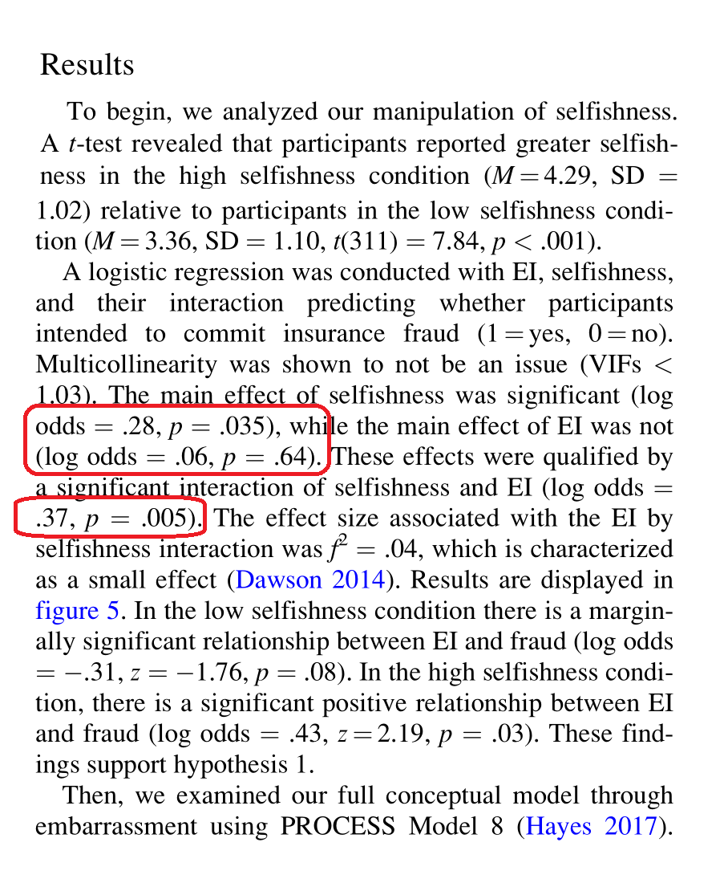
```

]


.pull-right[

```{r}
mod <- glm(Accident	~ Selfish*ZEI,
           data = d,
           family = binomial(link = "logit")
)

mod %>%
  gtsummary::tbl_regression()  #<<
```

]


---
## 

.pull-left[

```{r, echo=FALSE}
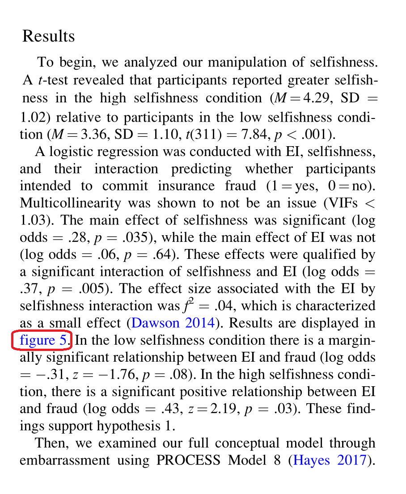
```

]


.pull-right[

```{r, eval=FALSE}
library(marginaleffects)

mod %>%
  marginaleffects::predictions(  #<<
    newdata = datagrid(
      Selfish = c(-1, 1),
      ZEI     = c(-1, 1)
    ),
    type = "response"
  ) %>%
  as_tibble()
```


```{r, echo=FALSE}
library(marginaleffects)

mod %>%
  marginaleffects::predictions(  #<<
    newdata = datagrid(
      Selfish = c(-1, 1),
      ZEI     = c(-1, 1)
    ),
    type = "response"
  ) %>%
  as_tibble() %>% 
  select(-std.error, -p.value, -s.value, -Accident) %>% 
  flextable::flextable() %>% 
  flextable::autofit() %>% 
  flextable::color(j = c("estimate", "Selfish", "ZEI"), color = "red")
```
]


---
## 

.pull-left[

```{r, echo=FALSE}
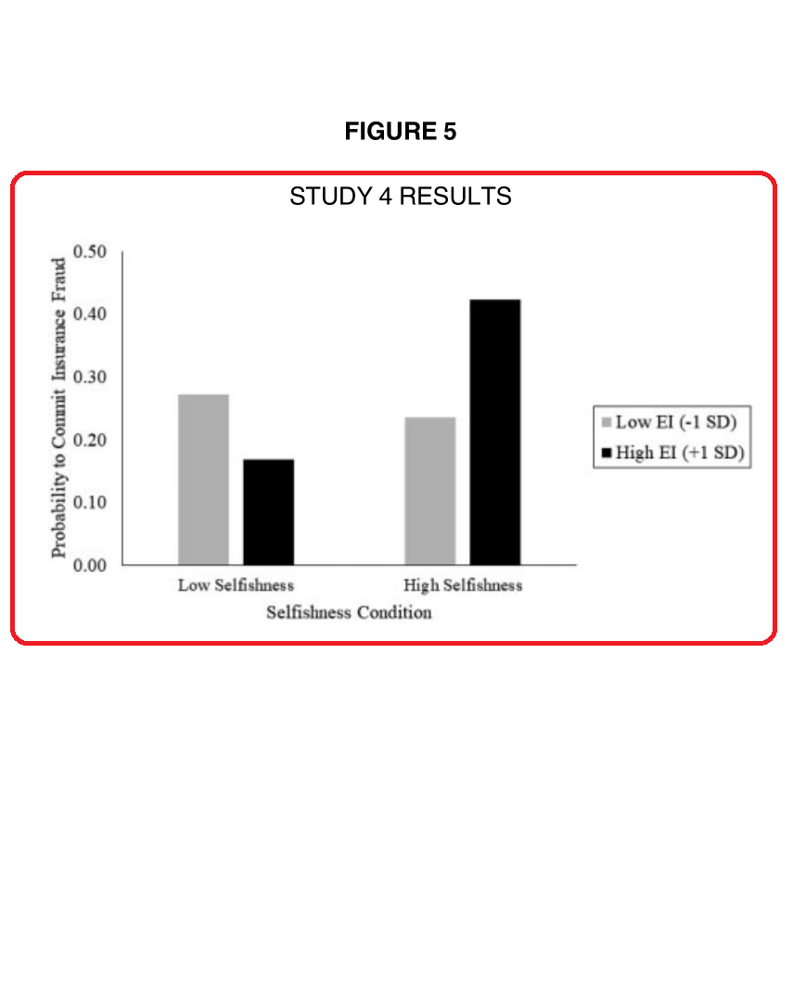
```

]


.pull-right[

```{r, eval=FALSE}
mod %>%
  marginaleffects::predictions(
    newdata = datagrid(
      Selfish = c(-1, 1),
      ZEI     = c(-1, 1)),
    type = "response"
  ) %>%
  as_tibble() %>% 
  mutate(
    across(c(Selfish, ZEI), as.factor)
  ) %>% 
  ggplot(aes(x = Selfish, y = estimate)) +
  geom_col(aes(fill = ZEI), 
    position = position_dodge(width = 0.8),
    width = 0.7
  )                           
```


```{r, echo=FALSE, fig.asp=0.518, fig.width = 5, out.width= "90%"}
library(marginaleffects)

mod %>%
  marginaleffects::predictions(
    newdata = datagrid(
      Selfish = c(-1, 1),
      ZEI     = c(-1, 1)
    ),
    type = "response"
  ) %>%
  as_tibble() %>% 
  
  mutate(across(c(Selfish, ZEI), as.factor)) %>% 
  ggplot(aes(x = Selfish, y = estimate)) +
  geom_col(
    aes(fill = ZEI), 
    position = position_dodge(width = 0.8),
    width = 0.7
  ) +
  scale_x_discrete(
    name   = "Selfishness Condition",
    breaks = c(-1, 1),
    labels = c("Low selfishness", "High selfishness")
  ) +
  scale_y_continuous(
    name   = "Probability to commit insurance fraud",
    limits = c(0, 0.5),
    expand = c(0, 0)
  ) +
  scale_fill_manual(
    name   = NULL,
    values = c("gray80", "black"),
    labels = c("Low EI(-1 SD)", "High EI(+1 SD)"),
    guide  = guide_legend(reverse = TRUE)
  ) +
  theme_classic() +
  theme(axis.ticks.x = element_blank())
```


]


---
## 

.pull-left[

```{r, echo=FALSE}
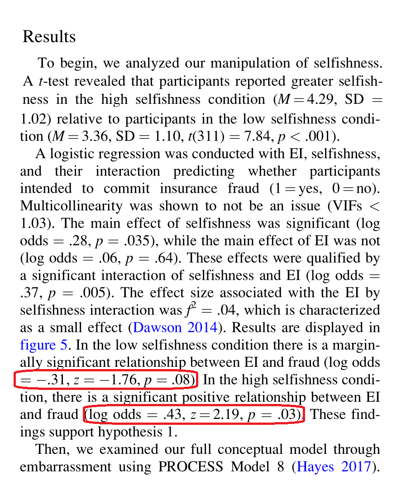
```

]


.pull-right[
```{r, eval=FALSE}
mod %>% 
  marginaleffects::slopes( #<<
    variables = "ZEI",
    by        = "Selfish",
    type      = "link"
  ) %>% 
  as_tibble()

```


```{r, echo=FALSE}
mod %>% 
  marginaleffects::slopes( #<<
    variables = "ZEI",
    by        = "Selfish",
    type      = "link"
  ) %>% 
  as_tibble() %>% 
  select(1:7) %>% 
  flextable::flextable() %>% 
  flextable::autofit() %>% 
  flextable::color(j = c("estimate", "statistic", "p.value"), color = "red")
```


]


---
## 

.pull-left[

```{r, echo=FALSE, out.width= "85%"}
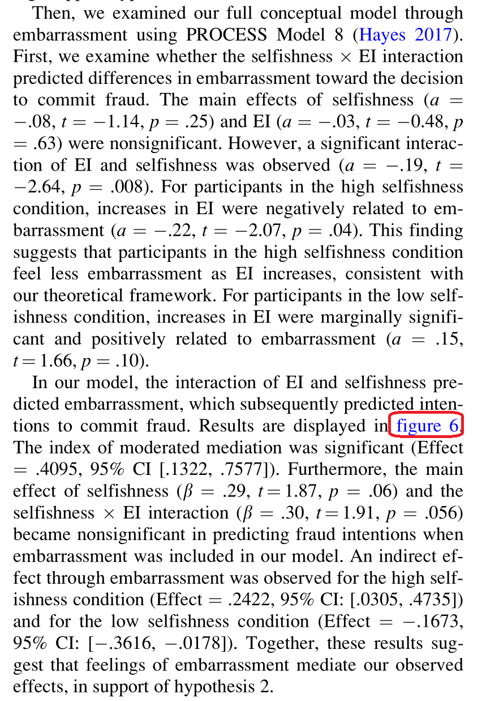
```

]


.pull-right[
<br>
```{r, echo=FALSE}
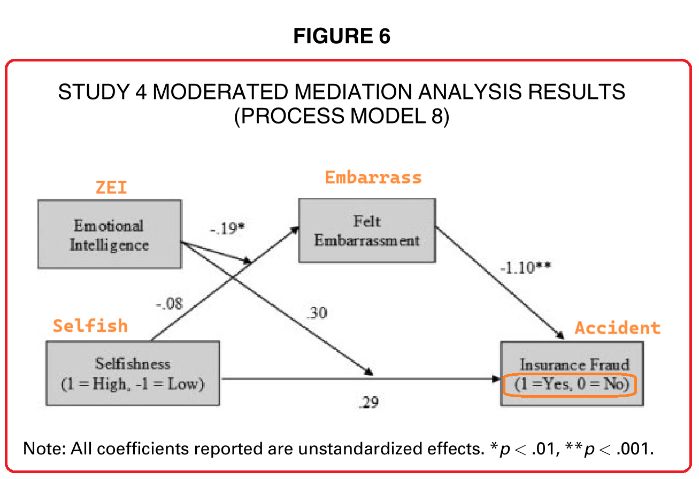
```
]


---
## 

.pull-left[

.small[
```{r}
Mediation_function_binary_outcome <- function(data_used, i) {
  # Sample a data
  data_temp <- data_used[i, ]
  
  # a path
  result_a <- lm(Embarrass ~ Selfish + ZEI + Selfish:ZEI, 
                 data = data_temp)
  
  a0 <- result_a$coefficients[1]
  a1 <- result_a$coefficients[2]
  a2 <- result_a$coefficients[3]
  a3 <- result_a$coefficients[4]
  
  # b path
  result_b <- glm(
    Accident ~ Embarrass + Selfish + ZEI + Selfish:ZEI, 
    data = data_temp, 
    family = binomial(link = "logit"))
  
  c0 <- result_b$coefficients[1]
  b  <- result_b$coefficients[2]
  c1 <- result_b$coefficients[3]
  c2 <- result_b$coefficients[4]
  c3 <- result_b$coefficients[5]


  # Index of Moderated Mediation
  IndexOfModMed <- a3 * b
  
  # Simple Slopes of Embarrass on ZEI
  aSSLow  <- a2 + a3 * (-1)    
  aSSHigh <- a2 + a3 * (1)     
  
  # Conditional Indirect Effects
  abLow  <- aSSLow  * b
  abHigh <- aSSHigh * b
  
  return(
    c(a1, a2, a3, c1, c2, c3, b, 
      IndexOfModMed, 
      aSSLow, aSSHigh, abLow, abHigh)
   ) 
}

```

]
]


.pull-right[

.small[
```{r}
library(boot)

boot_mediation <- boot(d, 
  Mediation_function_binary_outcome, 
  R = 5000
)

xcoef <- c(
  "a1", "a2", "a3", "c1", "c2", "c3", "b",
  "IndexOfModMed", "aSSLow", "aSSHigh", "abLow", "abHigh"
)

fun <- function(i) {
  aa <- boot::boot.ci(boot_mediation,
    index = i,
    conf = 0.95, type = "perc"
  )

  tibble(
    mean      = aa$t0,
    ci.lower  = aa$percent[4],
    ci.higher = aa$percent[5]
  )
}

res <- tibble(
  idx = 1:12,
  label = xcoef
) %>%
  rowwise() %>%
  mutate(fun(idx))
```

]
]


---
## 

.pull-left[

```{r, echo=FALSE, out.width= "85%"}
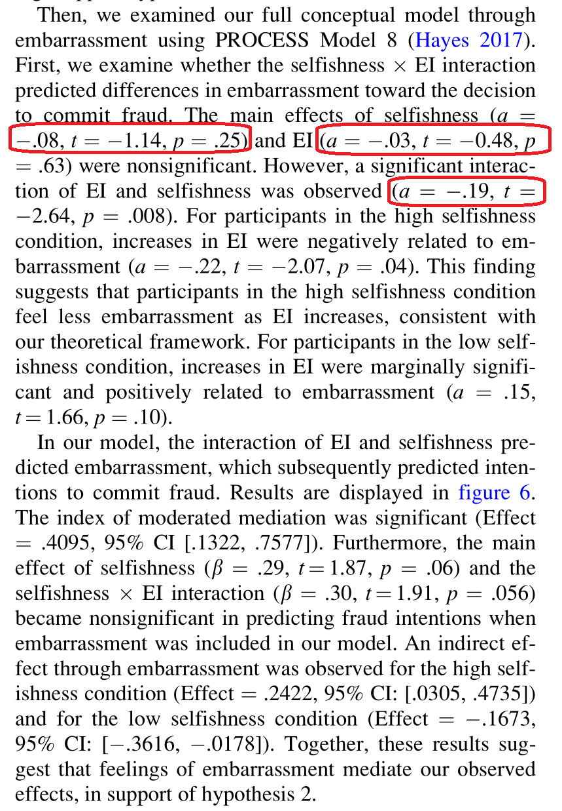
```

]


.pull-right[


```{r, echo=FALSE}
res %>% 
  flextable::flextable() %>% 
  flextable::colformat_double(digits = 3) %>% 
  flextable::color(
    i = ~ label %in% c("a1", "a2", "a3"), 
    color = "red"
  )
```

]


---
## 

.pull-left[

```{r, echo=FALSE, out.width= "85%"}
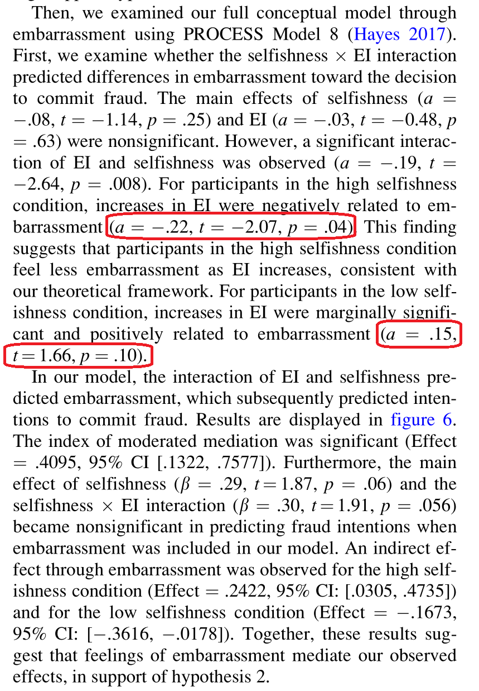
```

]


.pull-right[


```{r, echo=FALSE}
res %>% 
  flextable::flextable() %>% 
  flextable::colformat_double(digits = 3) %>% 
  flextable::color(
    i = ~ label %in% c("aSSLow", "aSSHigh"), 
    color = "red"
  )
```

]


---
## 

.pull-left[

```{r, echo=FALSE, out.width= "85%"}
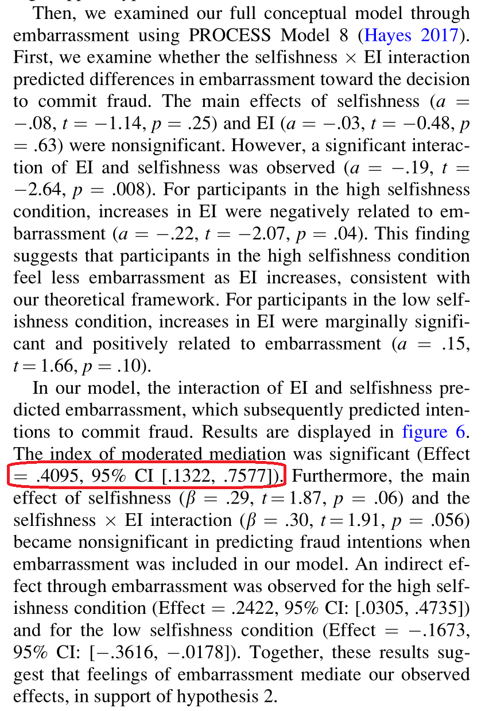
```

]


.pull-right[

```{r, echo=FALSE}
res %>% 
  flextable::flextable() %>% 
  flextable::colformat_double(digits = 3) %>% 
  flextable::color(
    i = ~ label %in% c("IndexOfModMed"), 
    color = "red"
  )
```

]


---
## 

.pull-left[

```{r, echo=FALSE, out.width= "85%"}
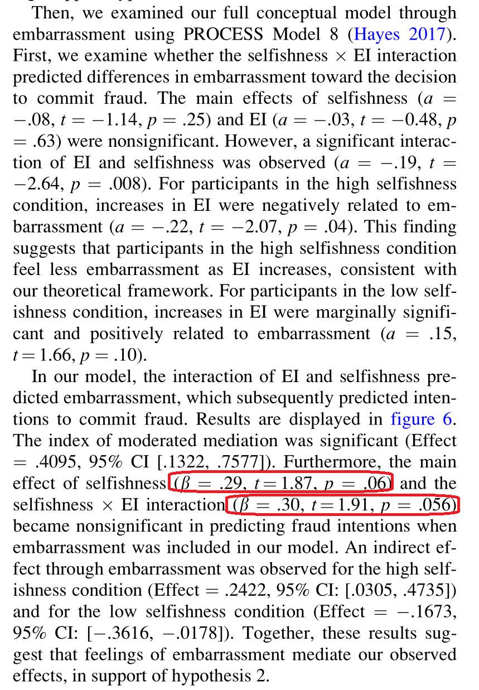
```

]


.pull-right[


```{r, echo=FALSE}
res %>% 
  flextable::flextable() %>% 
  flextable::colformat_double(digits = 3) %>% 
  flextable::color(
    i = ~ label %in% c("c1", "c3"), 
    color = "red"
  )
```


]


---
## 

.pull-left[

```{r, echo=FALSE, out.width= "85%"}
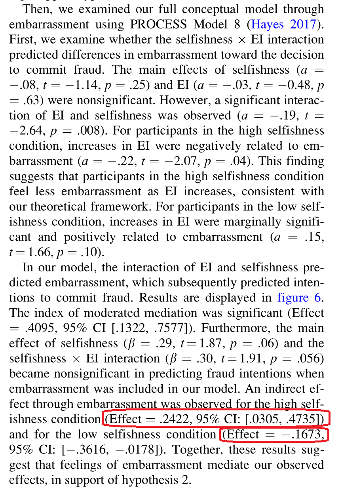
```

]


.pull-right[

```{r, echo=FALSE}
res %>% 
  flextable::flextable() %>% 
  flextable::colformat_double(digits = 3) %>% 
  flextable::color(
    i = ~ label %in% c("abLow", "abHigh"), 
    color = "red"
  ) 
```


]


---
## 我们接着看Study 5A

<br>

- STUDY 1
- STUDY 2
- STUDY 3
- STUDY 4
- .red[**STUDY 5A**]
- STUDY 5B AND 5C


---
class: center, middle

# 感谢 R 和 Stan 语言之美!

本幻灯片由 R 包 [**xaringan**](https://github.com/yihui/xaringan) 和 [**flipbookr**](https://github.com/EvaMaeRey/flipbookr) 生成

